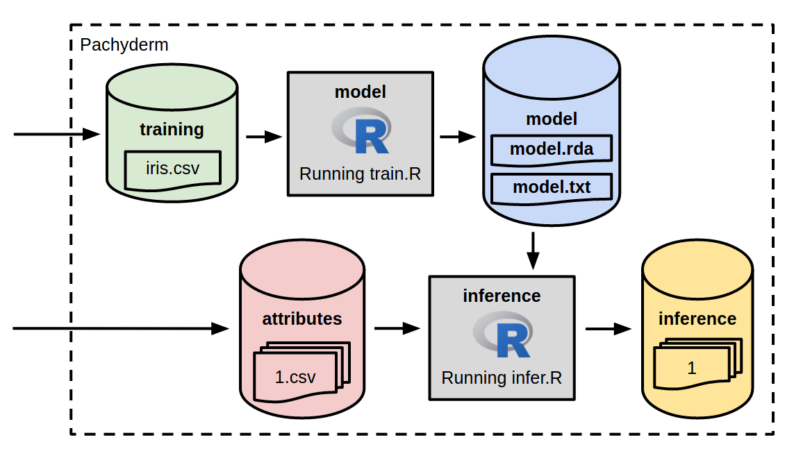

## Pachyderm Pipline for R-based Classification

This tutorial will walk you through the implementation of training and inference with a caret model in a Pachyderm pipeline.  Specifically, we will train a caret model to infer the species of iris flowers based on attributes of iris flowers.

## The pipeline

To deploy and manage the model discussed above, we will implement it’s training, model persistence, and inference in a Pachyderm pipeline.  This will allow us to:

- Keep a rigorous historical record of exactly what models were used on what data to produce which results.
- Automatically update online ML models when training data or parameterization changes.
- Easily revert to other versions of an ML model when a new model is not performing or when “bad data” is introduced into a training data set.

The general structure of our pipeline will look like this:



The cylinders represent data “repositories” in which Pachyderm will version training, model, etc. data (think “git for data”).  These data repositories are then input/output of the linked data processing stages (represented by the boxes in the figure).  

## Getting up and running with Pachyderm

You can experiment with this pipeline locally using a quick [local installation of Pachyderm](http://docs.pachyderm.io/en/latest/getting_started/local_installation.html).  Alternatively, you can quickly spin up a real Pachyderm cluster in any one of the popular cloud providers.  Check out the [Pachyderm docs](http://docs.pachyderm.io/en/latest/deployment/deploy_intro.html) for more details on deployment.

Once deployed, you will be able to use the Pachyderm’s `pachctl` CLI tool to create data repositories, create pipelines, and analyze our results.

## Training/fitting the model

First, let’s look our training stage.  The [train.R SVM](pachrtrain-svm/train.R) and [train.R LDA](pachrtrain-lda/train.R) R scripts (and corresponding Docker images) allow us to train an SVM model and an LDA model, respectively, using caret.  The data that we will use to train the model is freely available (e.g., [here](https://archive.ics.uci.edu/ml/datasets/Iris)) in CSV format.  

The `train.R` scripts take this CSV dataset as input and output representations of the trained/fit models in an RDA format, `model.rda`, along with a human readable summary of the model, `model.txt`.

## Inference with the caret model.

The [infer.R](pachrinfer/infer.R) script (and corresponding Docker image) allows us to infer iris species based on the persisted RDA representation of our model (see above).  `infer.R` takes that RDA model representation as input along with one or more CSV files, each listing particular attributes of flowers (for which we are trying to infer species):

```
5.7,2.8,4.1,1.3
6.3,3.3,6.0,2.5
5.8,2.7,5.1,1.9
7.1,3.0,5.9,2.1
5.1,3.5,1.4,0.2
4.9,3.0,1.4,0.2
```

`infer.R` then outputs an inference based on these attributes:

```
setosa 
virginica
versicolor
virginica
virginica
setosa
```

## Putting it all together, running the pipeline

First let's create Pachyderm "data repositories" in which we will version our training dataset and our attributes (from which we will make predictions):

```
➔ pachctl create-repo training
➔ pachctl create-repo attributes
➔ pachctl list-repo
NAME                CREATED             SIZE                
attributes          1 seconds ago       0 B                 
training            5 seconds ago       0 B                 
➔
```

Next we put our training data set in the `training` repo:

```
➔ cd data/
➔ pachctl put-file training master -c -f iris.csv
➔ pachctl list-repo
NAME                CREATED             SIZE                
training            55 seconds ago      4.444 KiB           
attributes          51 seconds ago      0 B                 
➔ pachctl list-file training master
NAME                TYPE                SIZE                
iris.csv            file                4.444 KiB           
➔
```

We can then create our training and inference pipelines based on JSON specifications ([train.json](train.json) and [infer.json](infer.json)) specifying the Docker images to run for each processing stage, the input to each processing stage, and commands to run in the Docker images.  You could use either the SVM (`dwhitena/pachrtrain:svm`) or LDA (`dwhitena/pachrtrain:lda`) models in [train.json](train.json). This will automatically trigger the training of our model and output of the RDA model representation, because Pachyderm sees that there is training data in `training` that has yet to be processed:

```
➔ cd ..
➔ pachctl create-pipeline -f train.json 
➔ pachctl list-job
ID                                   OUTPUT COMMIT                          STARTED        DURATION   RESTART PROGRESS STATE            
a7c30bdf-0bd1-4e8c-b2b2-d485d7d6ec6e model/d08bda7cf7df45ba8d8989f1461def7c 39 seconds ago 18 seconds 0       1 / 1    success 
➔ pachctl list-repo
NAME                CREATED             SIZE                
model               47 seconds ago      9.626 KiB           
training            3 minutes ago       4.444 KiB           
attributes          3 minutes ago       0 B                 
➔ pachctl list-file model master
NAME                TYPE                SIZE                
model.rda           file                9.013 KiB           
model.txt           file                628 B               
➔ pachctl get-file model master model.txt
Support Vector Machines with Radial Basis Function Kernel 

150 samples
  4 predictor
  3 classes: 'Iris-setosa', 'Iris-versicolor', 'Iris-virginica' 

No pre-processing
Resampling: Cross-Validated (10 fold) 
Summary of sample sizes: 135, 135, 135, 135, 135, 135, ... 
Resampling results across tuning parameters:

  C     Accuracy   Kappa
  0.25  0.9533333  0.93 
  0.50  0.9533333  0.93 
  1.00  0.9466667  0.92 

Tuning parameter 'sigma' was held constant at a value of 0.8131481
Accuracy was used to select the optimal model using  the largest value.
The final values used for the model were sigma = 0.8131481 and C = 0.25.
➔
```

Finally, we can create out inference pipeline stage and commit some attribute files into `attributes` to trigger predictions:

```
➔ pachctl create-pipeline -f infer.json 
➔ cd data/test/
➔ ls
1.csv  2.csv
➔ pachctl put-file attributes master -c -r -f .
➔ pachctl list-job
ID                                   OUTPUT COMMIT                              STARTED        DURATION   RESTART PROGRESS STATE            
eaac63e3-176d-49e0-a1f5-4ce9be173fea inference/e8fae4ab58ba46e5a8014f0b95fc68ba 17 seconds ago 7 seconds  0       2 / 2    success 
a7c30bdf-0bd1-4e8c-b2b2-d485d7d6ec6e model/d08bda7cf7df45ba8d8989f1461def7c     2 minutes ago  18 seconds 0       1 / 1    success 
➔ pachctl list-repo
NAME                CREATED             SIZE                
inference           39 seconds ago      65 B                
attributes          5 minutes ago       112 B               
model               2 minutes ago       9.626 KiB           
training            5 minutes ago       4.444 KiB           
➔ pachctl list-file inference master
NAME                TYPE                SIZE                
1                   file                10 B                
2                   file                55 B                
➔ pachctl get-file inference master 2
versicolor
virginica
virginica
virginica
setosa
setosa
➔
```
